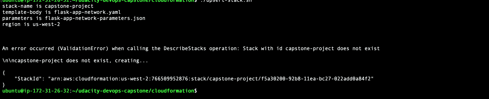
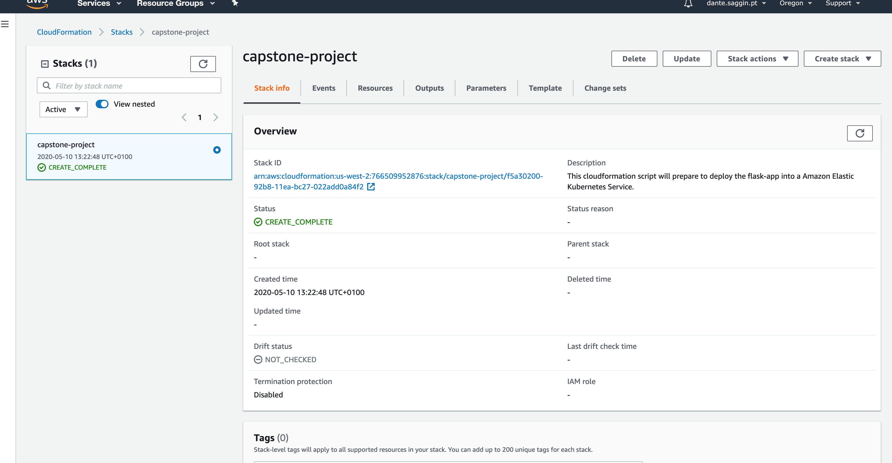
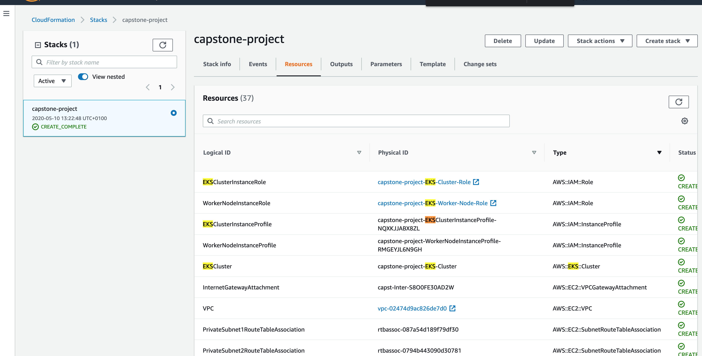
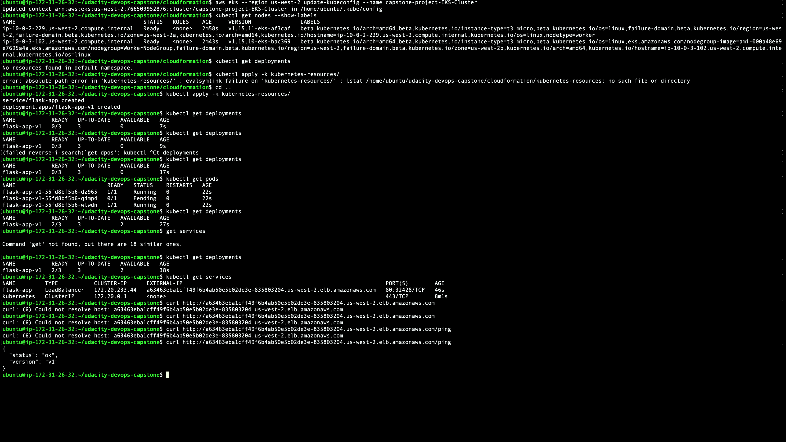
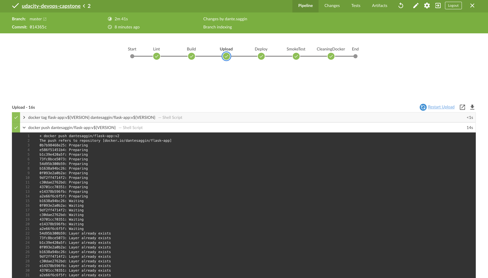
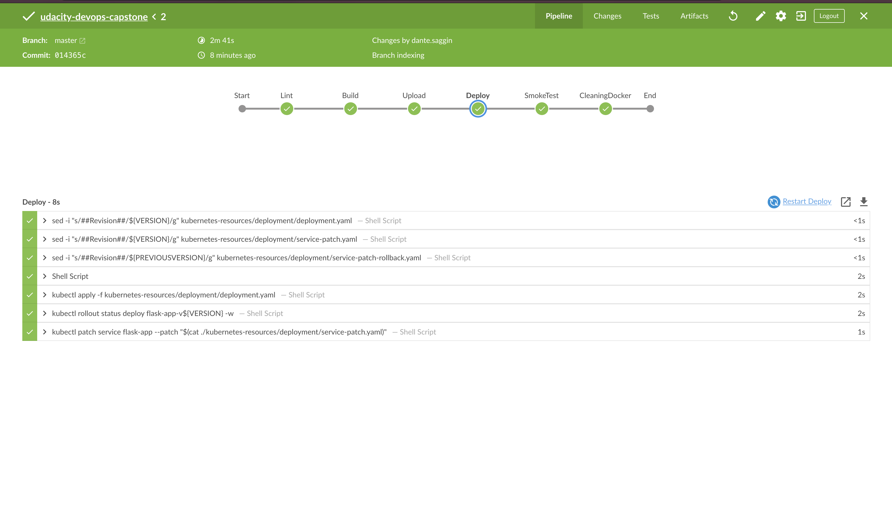
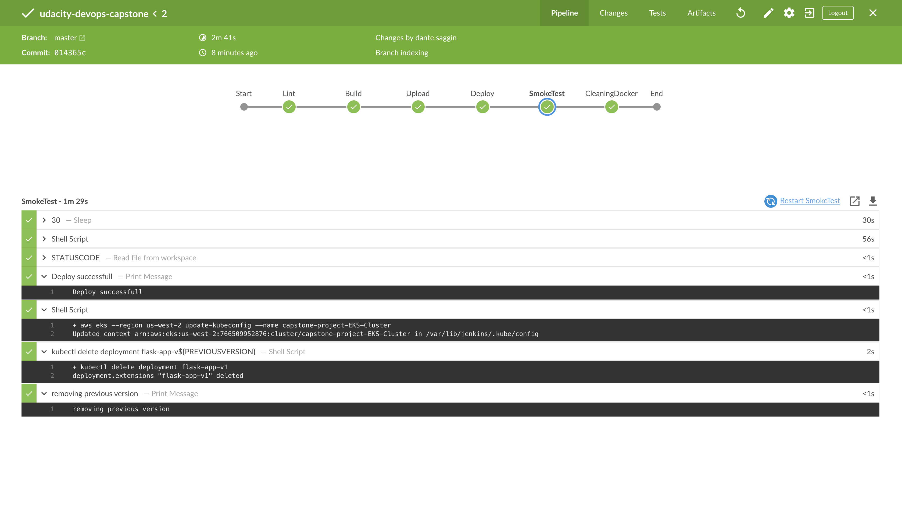
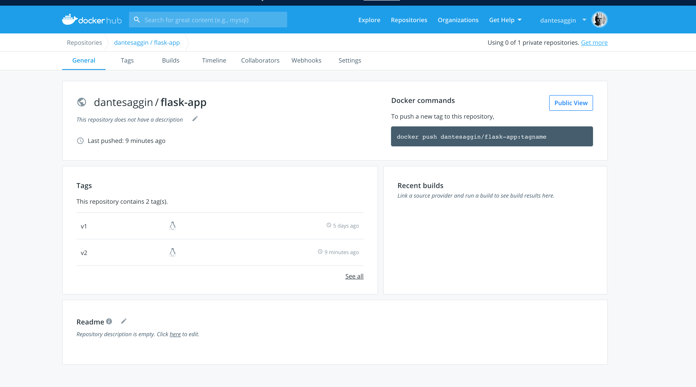
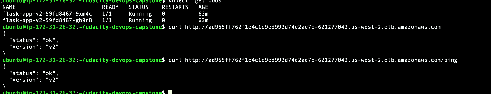
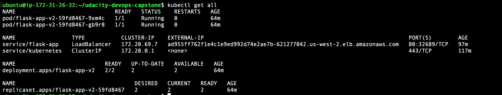

# udacity-devops-capstone
Udacity devops capstone

Execution the script bellow it will create the required infrastructure
```
$./cloudformation/upsert-stack.sh
```
## Cloud Formation Execution

## Cloud Formation Console

## Cloud Formation Itens Created


As part of the initial setup I deployed the first version of the code in the EKS cluster


Creating the pipeline in the Jenkins to execute it should deploy the v2**




After the deployment the image will be uploaded into docker hub


And the version will return v2 into the /ping





**In order to control the version to be deployed and the version to rollback we have the files revision and versionToRollback in the deployments folder