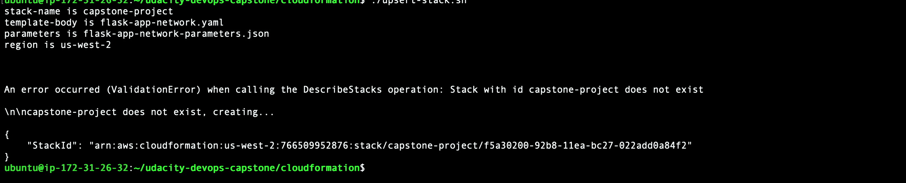
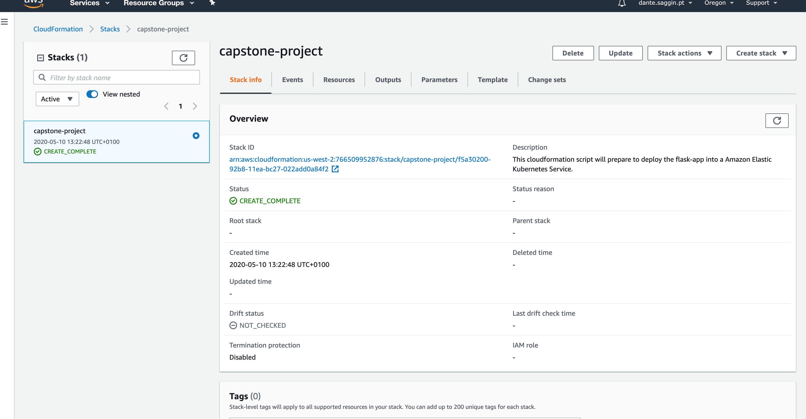
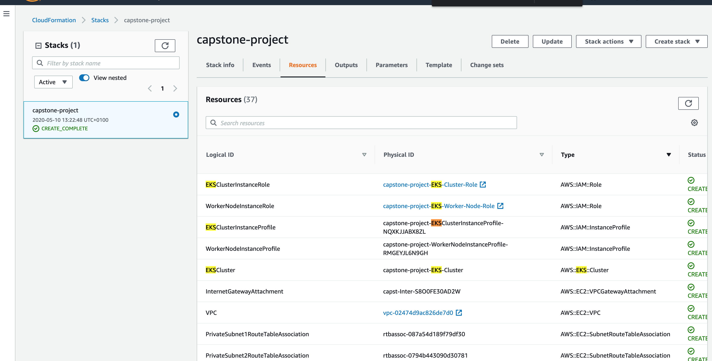
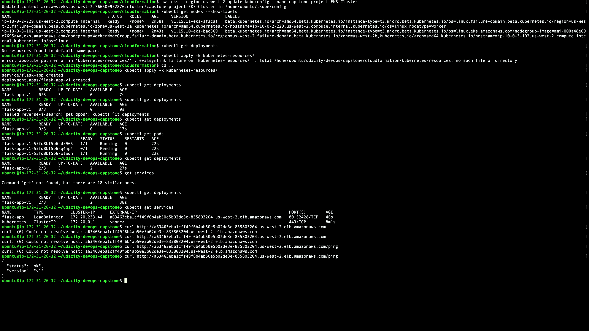
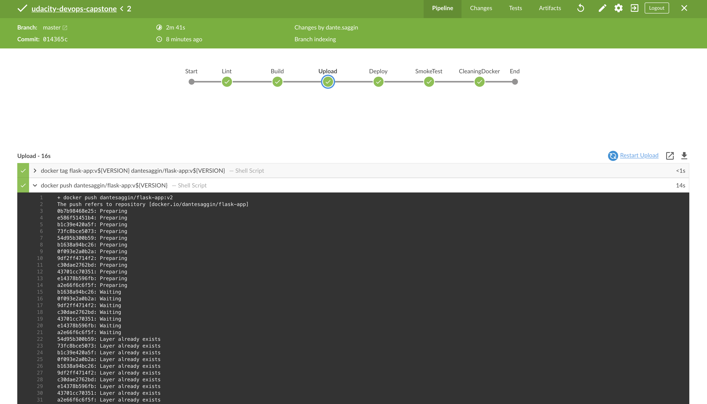
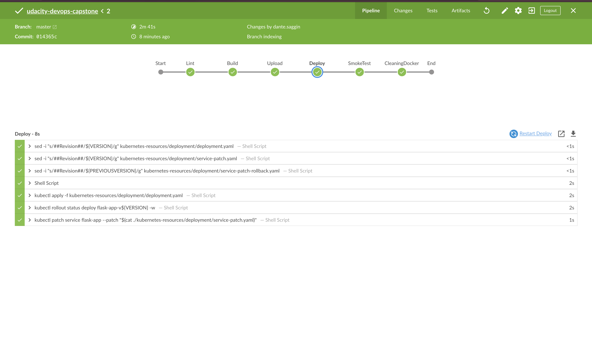
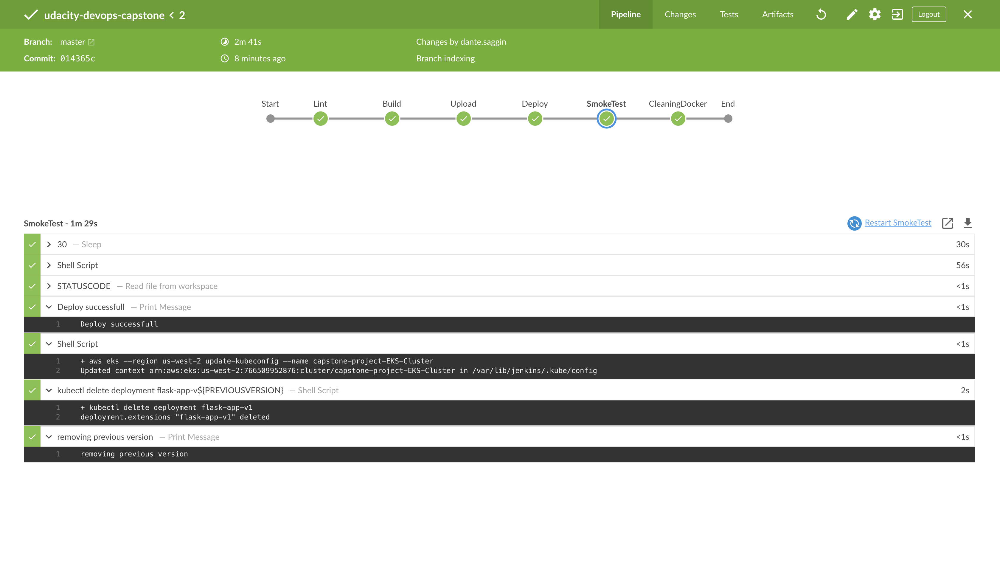
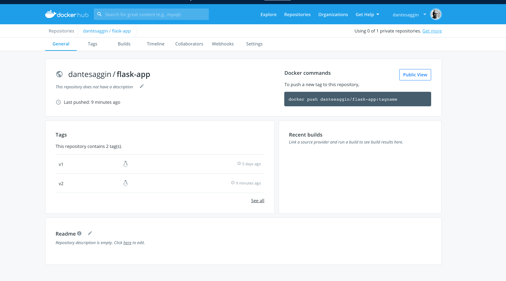
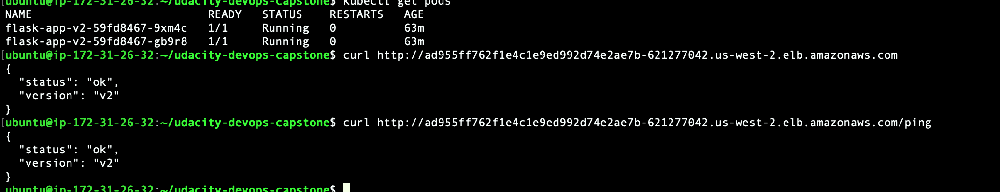
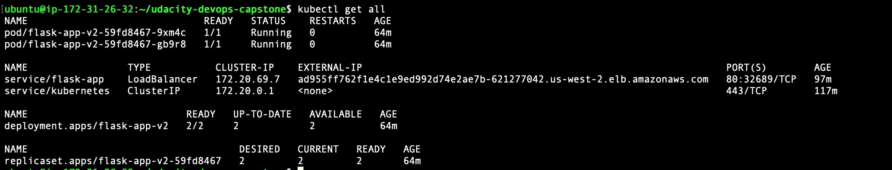

# udacity-devops-capstone
Udacity devops capstone

The cloudformation script will create the infrastructure base, I have a shell script to simplify the executinon and it can found at.
```
$./cloudformation/upsert-stack.sh
```

## Cloud Formation Execution

## Cloud Formation Console

## Cloud Formation Itens Created


After the execution of the cloudformation script it's necessary check and deploy the initial revision into the EKS Cluster
### Checking EKS and doing the First deployment.


Creating the pipeline in the Jenkins to execute it should deploy the v2 using a blue/green strategy,
more info on how this strategy work can be found on [Kubernetes-Resources Read me](./kubernetes-resources/)
the revision to deploy and the revision to rollback are controled by the files revision and versionToRollback in the deployments folder

### upload docker image

### Deploy into the EKS cluster

### SmokeTesting


After the deployment the image will be uploaded into docker hub


And the version will return v2 into the /ping


A resume of all deployed resources at the end of the process.


