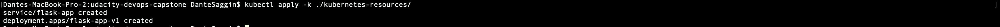
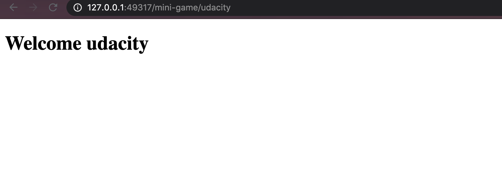
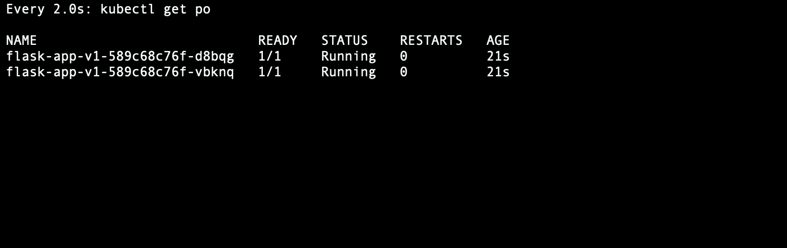
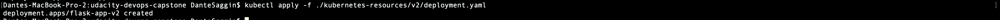
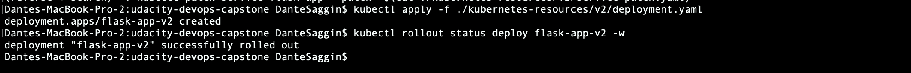
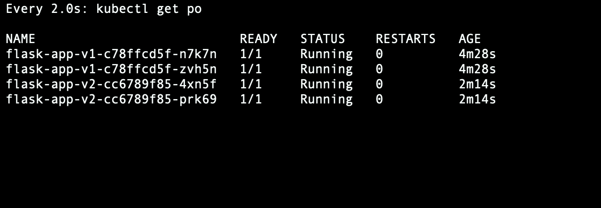
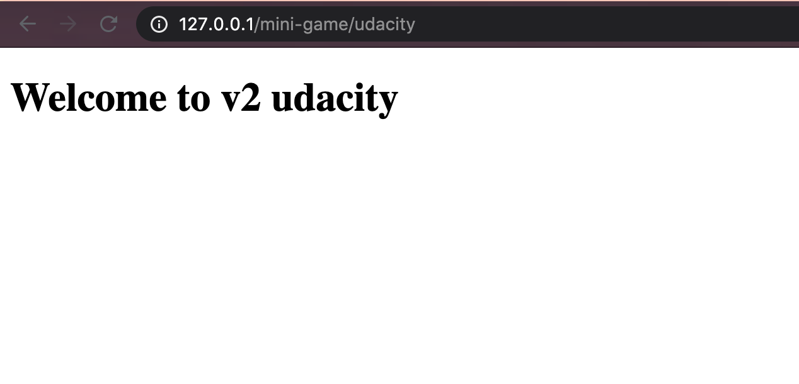

Blue/green Deployment
=================================================

> Deploy flask-app using the blue/green deployment strategy.

## How it happens

1. version 1 is exposed by the load balancer
1. deploy version 2, the pods will slowly start
1. watch the pods waiting for the version 2 be ready
1. switch incoming traffic from version 1 to version 2
1. if there is a problem roll-back to incomming traffic back to version 1
1. remove version 1


## In practice

```bash
# Deploy the first application
## 1. version 1 is exposed by the load balancer
$ kubectl apply -k ./kubernetes-resources/



# Test if the deployment was successful
$ curl $(minikube service flask-app --url)/ping
# it Can be done by hitting loadbalancer external ip


# To see the deployment in action, open a new terminal and run the following

$ watch kubectl get po


# deploy version 2 of the application
## 2. deploy version 2, the pods will slowly start
$ kubectl apply -f ./kubernetes-resources/v2/deployment.yaml


# Wait for all the version 2 pods to be running
#
$ kubectl rollout status deploy flask-app-v2 -w
deployment "flask-app-v2" successfully rolled out


# check the pod's
## 3. watch the pods waiting for the version 2 be ready
$ watch kubectl get po

# Side by side, the pods will be running both in version 1 and version 2, but the traffic is going to version 1

# Using the command below we will update the loadbalance in order to send traffic to all pods with label version=v2.0.0
## 4. switch incoming traffic from version 1 to version 2
$ kubectl patch service flask-app --patch "$(cat ./kubernetes-resources/v2/service-patch.yaml)"


# Check if the deployment was sucessifuly
$ service=$(minikube service flask-app --url)/ping
$ while sleep 0.1; do curl "$service"; done

# It can be done by hitting the load balancer and see that the result is compliant with the v2 version


# in order to rollback to the previous version
## 5. if there is a problem roll-back to incomming traffic back to version 1
$ kubectl patch service flask-app --patch "$(cat ./kubernetes-resources/v2/service-patch-rollback.yaml)"

# If everything is working as expected, you can then delete the v1.0.0
## 6. remove version 1
$ kubectl delete deploy flask-app-v1
```

### Cleanup

```bash
$ kubectl delete all -l app=flask-app
```
